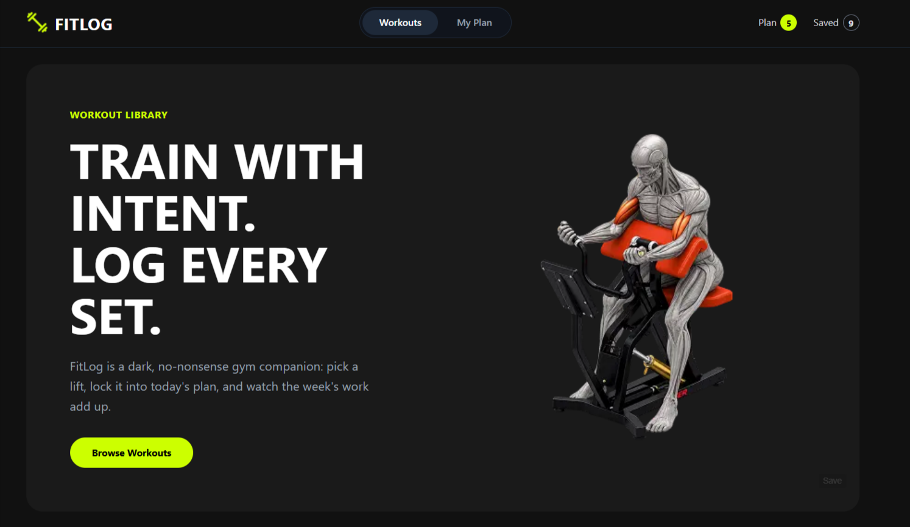
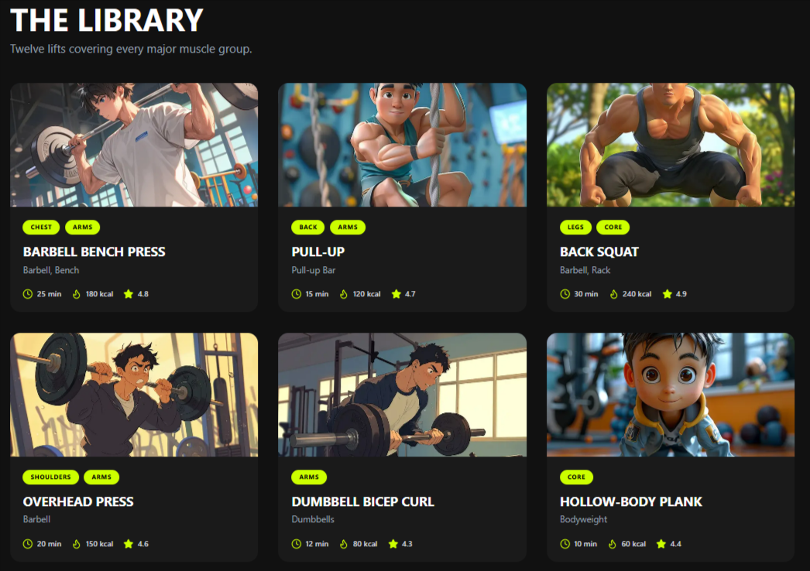
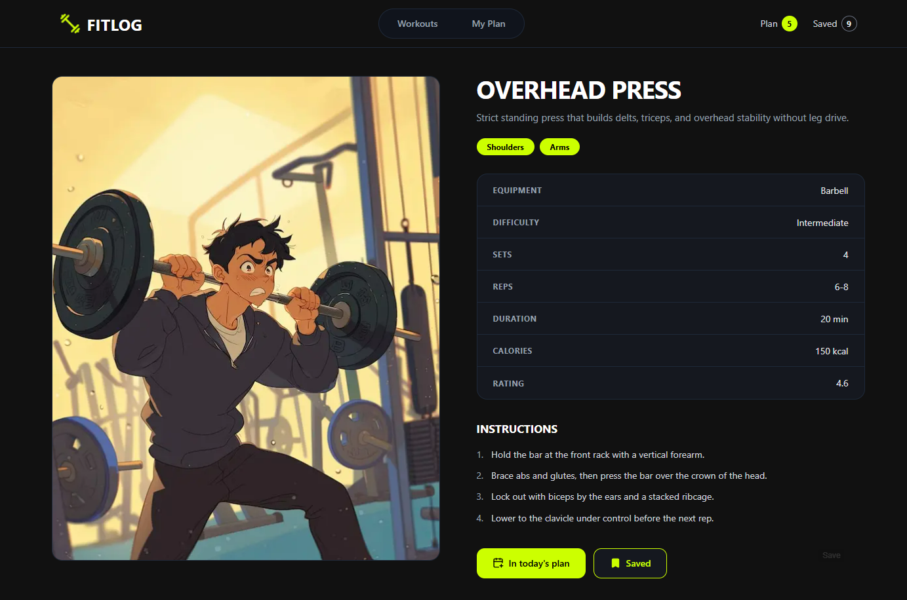
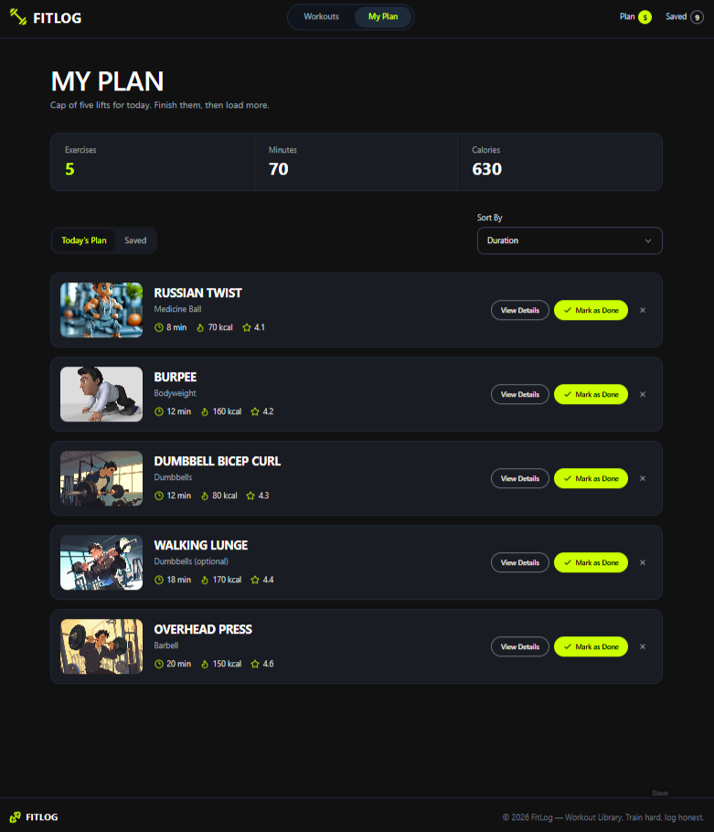

# FitLog - Fitness Tracking Web App

**FitLog** is a modern, responsive frontend web application designed to help users plan their daily workouts, track total exercise time and calories, and save favorite routines for later.

The goal of this project was to build a highly interactive, state-driven application using Next.js and Tailwind CSS, focusing on advanced state management, custom UI components, and a sleek dark-mode aesthetic.

## 🌐 Live Demo & Repository

🔗 **Live Website:** https://fitlog-iamsahedrana.vercel.app/

🔗 **GitHub Repository:** https://github.com/IamSahedRana/FitLog

---

# ✨ 5 Key Features

1. **Interactive Workout Library:** Browse a comprehensive list of exercises with quick-glance metrics and dynamically sort them by duration, calories, or rating.
2. **"Today's Plan" Daily Tracker:** Add exercises to your daily routine while an automated calculator dynamically aggregates your total planned minutes and total calories burned.
3. **"Saved Workouts" Bookmarking:** A dedicated bookmarking system to save your favorite routines and access them seamlessly later.
4. **Persistent State Management:** Powered by Zustand and local storage, ensuring your planned and saved workouts remain intact even after refreshing the page.
5. **Modern Dark Theme UI & Custom Components:** A fully responsive, mobile-first dark design featuring custom-built dropdown menus (replacing native HTML selects) and precise image cropping for a polished look.

---

# 🛠️ Technologies Used

- **Framework:** Next.js (App Router)
- **Library:** React
- **Language:** TypeScript
- **Styling:** Tailwind CSS
- **State Management:** Zustand
- **Icons:** Lucide React

---

# 📷 Project Sections

## 1. Navigation Bar

> Screenshot: `./Preview/navbar.png`



### Description
The navigation bar was designed to keep the user informed of their current workout status while providing seamless routing.

Features include:
- Fully responsive layout with a mobile hamburger menu.
- Dynamic counters reflecting the number of items in "Today's Plan" and "Saved".
- Perfectly aligned and constrained logo scaling.
- Hydration-safe rendering for state-driven UI elements.

## 2. The Library (Home/Hero Section)

> Screenshot: `./Preview/library.png`



### Description
The main dashboard where users can browse available workouts covering major muscle groups.

Features include:
- Responsive CSS Grid layout for workout cards.
- Optimized Next.js `<Image/>` components utilizing custom focal points to ensure character faces and main visual elements are never cropped out.
- Hover states with scale effects and brand-colored rings.

## 3. Workout Details & Actions

> Screenshot: `./Preview/workout-actions.png`



### Description
Interactive components allowing users to manage their fitness journey. 

Features include:
- Tag-based display for targeted muscle groups.
- One-click functionality to "Add to Plan" or "Save for Later".
- Zustand-powered state that immediately reflects choices across the app without reloading.

## 4. My Plan Page

> Screenshot: `./Preview/my-plan.png`



### Description
A dedicated dashboard for managing the user's selected routines.

Features include:
- **Tabbed Interface:** Switch smoothly between "Today's Plan" and "Saved" workouts.
- **Custom Sort Dropdown:** A fully custom, Tailwind-styled dropdown menu that replaces the native HTML `<select>`, allowing users to sort their workouts seamlessly within the dark theme.
- **Empty States:** Helpful fallback UI prompting users to browse the library if their plan is empty.

---

# 🎨 Design Highlights

- **Dark Mode First:** Built on a deep, modern dark palette (`#16181D`, `#191c22`) with high-contrast neon brand accents.
- **Typography:** Bold, uppercase display fonts for headers combined with clean sans-serif text for readability.
- **Fluid Responsiveness:** Seamless transitions from mobile to tablet to desktop views using Tailwind's utility classes.
- **Component Polish:** Custom overlays, invisible backdrops for dropdowns, and precise padding/margins.

---

# 📚 What I Practiced

While building this project I practiced:

- **Next.js App Router:** Handling client-side routing and hydration.
- **Zustand:** Setting up a global store to manage complex state (arrays of objects) across multiple disconnected components.
- **React Hooks:** Extensive use of `useState`, `useEffect` (handling Next.js hydration safety), and `useMemo` (for efficient sorting algorithms).
- **TypeScript:** Defining strict types and interfaces (`Workout`, `Tab`, `SortOption`) for reliable data handling.
- **Tailwind CSS:** Building complex Grid and Flexbox layouts, creating custom dropdowns, and managing image aspect ratios.

---

# 📂 Project Structure

```text
FitLog/
│
├── src/
│   ├── app/                 ← Next.js App Router pages (Home, My Plan, Workout Details)
│   ├── components/          ← Reusable UI components
│   │   ├── cards/           ← PlanCard, WorkoutCard
│   │   ├── home/            ← Hero, WorkoutGrid
│   │   └── shared/          ← Navbar, Footer
│   ├── store/               ← Zustand state management (useFitlogStore.ts)
│   └── types/               ← TypeScript interfaces
│
├── public/                  
│   └── assets/              ← Static images, logos, and banners
│
├── tailwind.config.ts       ← Custom theme colors and configurations
└── README.md                ← You are here

```

🙌 Acknowledgements
This project was built as a significant milestone in my web development learning journey.

Throughout the development process, I focused on solving real-world frontend challenges—such as state persistence, hydration errors, custom UI components, and precise image cropping—rather than relying on pre-built UI libraries. Every component was carefully crafted to ensure a smooth, professional user experience.

⭐ If you like this project, feel free to give it a star on GitHub!

